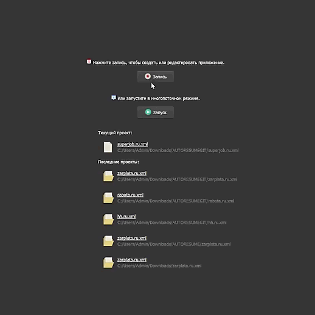

# Automate-with-BAS
Автоматическое поднятие резюме на российских сайтах с вакансиями для поиска работы и прочие проекты автоматизации.

- поднятие резюме
- парсер прокси
- чекер прокси в многопотоке
- просмотры для YouTube, rutube, VK

# Демо superjob.ru

  

- Открыт проект, жмем Запись в BAS
- Так как вход не выполнен, выполняется автоматически авторизация
- Вводятся данные из функции Auth
- Сохраняются cookies для дальнейшего беспарольного входа
- Кнопка поднятия существует, нажимается
# Инструкция
- Поставить [BAS](https://bablosoft.com/shop/BrowserAutomationStudio)
- Открыть проект и нажать запись
- Отредактировать нужные поля, например в функции Auth
- Выполнить авторизацию с сохранением cookies
- Закинуть проект в Планировщик
